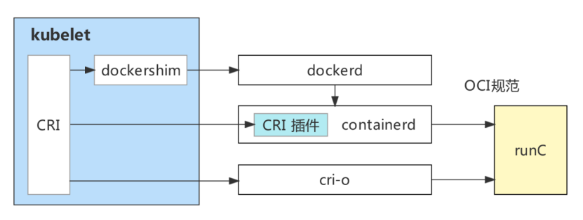

# 弃用 Dockershim 的常见问题

https://kubernetes.io/zh-cn/blog/2020/12/02/dockershim-faq/

2.2 kubernetes支持哪些容器运行时？

kubernetes支持任何符合CRI标准的容器运行时。在1.23版本之前，常用的容器运行时有三种：docker、containerd、cri-o.

在1.24以后,可以继续使用docker+cri-dockerd

https://baijiahao.baidu.com/s?id=1726360603534861943&wfr=spider&for=pc

#### dockerd

dockerd本身实属是对容器相关操作的api的最上层封装，直接面向操作用户。

#### containerd

dockerd实际真实调用的还是containerd的api接口（rpc方式实现），containerd是dockerd和runc之间的一个中间交流组件。

#### docker-shim

docker-shim是一个真实运行的容器的真实垫片载体，每启动一个容器都会起一个新的docker-shim的一个进程，
他直接通过指定的三个参数：容器id，boundle目录（containerd的对应某个容器生成的目录，一般位于：/var/run/docker/libcontainerd/containerID），
运行是二进制（默认为runc）来调用runc的api创建一个容器（比如创建容器：最后拼装的命令如下：runc create 。。。。。）

#### runc

runc是一个命令行工具端，他根据oci（开放容器组织）的标准来创建和运行容器。

https://blog.51cto.com/zhangxueliang/4945674

https://github.com/cri-o/cri-o

# CRI-O - OCI-based implementation of Kubernetes Container Runtime Interface

CRI-O is meant to provide an integration path between OCI conformant runtimes and the Kubelet. Specifically, it implements the Kubelet [Container Runtime Interface (CRI)](https://github.com/kubernetes/community/blob/master/contributors/devel/sig-node/container-runtime-interface.md) using OCI conformant runtimes. The scope of CRI-O is tied to the scope of the CRI.

This is an implementation of the Kubernetes Container Runtime Interface (CRI) that will allow Kubernetes to directly launch and manage Open Container Initiative (OCI) containers.

The plan is to use OCI projects and best of breed libraries for different aspects:

- Runtime: [runc](https://github.com/opencontainers/runc) (or any OCI runtime-spec implementation) and [oci runtime tools](https://github.com/opencontainers/runtime-tools)
- Images: Image management using [containers/image](https://github.com/containers/image)
- Storage: Storage and management of image layers using [containers/storage](https://github.com/containers/storage)
- Networking: Networking support through the use of [CNI](https://github.com/containernetworking/cni)