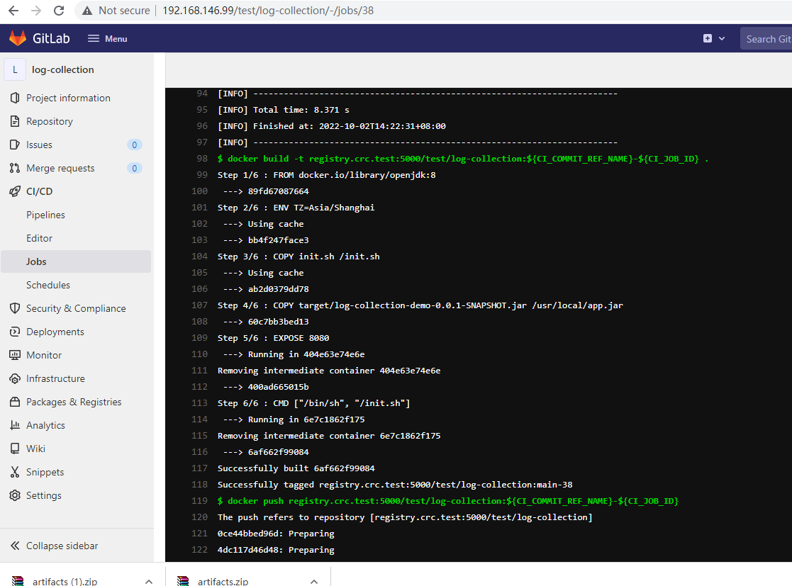

maven build ci pipeline 

基本的:

```
build:
  stage: build
  script:
    - mvn clean package -DskipTests

```


自定义 stage,加可以下载artificats

```
# stage也可以自定义
stages:
  - build jar

#job's name 可以随意取
buildJar:
  stage: build jar
  script:
    - mvn clean package
  artifacts:
    paths:
      - target/log-collection-demo-0.0.1-SNAPSHOT.jar
    expire_in: 3600 seconds

```


构建docker, $CI_COMMIT_REF_NAME这里是分支名

变量参考:

https://docs.gitlab.com/ee/ci/variables/predefined_variables.html

```
# cat .gitlab-ci.yml 
# stage也可以自定义
stages:
  - build jar
  - build image

#job's name 可以随意取
buildJar:
  stage: build jar
  script:
    - mvn clean package
  artifacts:
    paths:
      - target/log-collection-demo-0.0.1-SNAPSHOT.jar
    expire_in: 3600 seconds

buildImage:
  stage: build image
  script:
    - docker build -t registry.crc.test:5000/test/log-collection:$CI_COMMIT_REF_NAME .

```


完整的构建,并push 到registry,使用这个demo, 增加这个文件.gitlab-ci.yml到代码库中


```
cat .gitlab-ci.yml
# stage也可以自定义
stages:
  - build jar
  - build image

#job's name 可以随意取
buildJar:
  stage: build jar
  script:
    - mvn clean package
    - docker build -t registry.crc.test:5000/test/log-collection:${CI_COMMIT_REF_NAME}-${CI_JOB_ID} .
    - docker push registry.crc.test:5000/test/log-collection:${CI_COMMIT_REF_NAME}-${CI_JOB_ID}
  artifacts:
    paths:
      - target/log-collection-demo-0.0.1-SNAPSHOT.jar
    expire_in: 3600 seconds
    
    
```


经常遇到的问题是init git repo失败,删除后台job 中的repo目录,重新执行

以下docker push如果失败,将/root/.docker/config.json　cp到/home/gilab-runner/.docker,

chown -R gitlab-runner:gitlab-runner /home/gitlab-runner/.docker/



