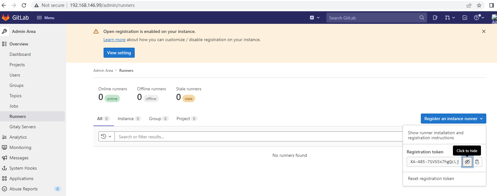
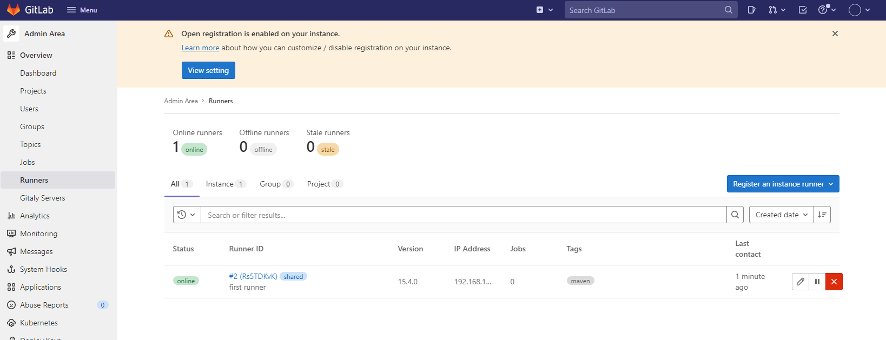

## Ｄocker运行gitlab-ce server

#### 安装

```
mkdir -p /data/gitlab/{config,logs,data}

docker run -d \
       --hostname 192.168.3.96  \
       -p 10022:22 -p 80:80 -p 443:443 \
       --restart always \
       --volume /data/gitlab/config:/etc/gitlab \
       --volume /data/gitlab/logs:/var/log/gitlab \
       --volume /data/gitlab/data:/var/opt/gitlab \
       --name gitlab \
       gitlab/gitlab-ce

```

#### 访问,

wait for about 5 minutes

```
用户root口令在文件: cat /data/gitlab/config/initial_root_password

root


访问　http://192.168.146.99
```

,先修改口令为: Q1w2e3r4


#### 建立repo

新建一个group test, 设为public 

测试在test group,新建一个repo　log-collection,设为public,　push ,commit


#### push commit,

clone log-collection to local and commit , push 

git clone http://192.168.146.99/test/log-collection.git

cp code from https://gitee.com/mikerain/log-collection.git


```
# git push origin main
Username for 'http://192.168.146.99': root
Password for 'http://root@192.168.146.99': 
Counting objects: 43, done.
Delta compression using up to 4 threads.
Compressing objects: 100% (34/34), done.
Writing objects: 100% (42/42), 18.69 KiB | 0 bytes/s, done.
Total 42 (delta 1), reused 0 (delta 0)
To http://192.168.146.99/test/log-collection.git
   be8417d..1fdb594  main -> main

```


#### find runner token from gitlab 

在Gitlab ->admin area->overview->Runner->registry an runner->copy the token




## Runner安装

https://blog.csdn.net/weixin_42151900/article/details/123820266

docker

pod

shell


```
wget https://packages.gitlab.com/install/repositories/runner/gitlab-runner/script.rpm.sh
sh script.rpm.sh  (要求能上网)

#yum install gitlab-runner -y

# gitlab-runner status
Runtime platform                                    arch=amd64 os=linux pid=19546 revision=43b2dc3d version=15.4.0
gitlab-runner: Service is running

systemctl status gitlab-runner.service


# gitlab-runner register
Runtime platform                                    arch=amd64 os=linux pid=17936 revision=43b2dc3d version=15.4.0
Running in system-mode.

Enter the GitLab instance URL (for example, https://gitlab.com/):
http://192.168.146.99
Enter the registration token:
XA-485-71VS5x7hgQcLj
Enter a description for the runner:
[gitlab]: maven runner
Enter tags for the runner (comma-separated):
maven
Enter optional maintenance note for the runner:

Registering runner... succeeded                     runner=XA-485-7
Enter an executor: custom, docker, ssh, docker+machine, docker-ssh+machine, docker-ssh, parallels, shell, virtualbox, kubernetes:
shell
Runner registered successfully. Feel free to start it, but if it's running already the config should be automatically reloaded!

Configuration (with the authentication token) was saved in "/etc/gitlab-runner/config.toml"


gitlab-runner -h 可使用其他子命令


----
for taikang runner
[root@jenkins runner]#  gitlab-runner register
Runtime platform                                    arch=amd64 os=linux pid=100991 revision=7178588d version=15.5.1
Running in system-mode.                            
                                                   
Enter the GitLab instance URL (for example, https://gitlab.com/):
http://192.168.3.96       
Enter the registration token:
L4TK2KJ7AmMTfuzA3t1-
Enter a description for the runner:
[jenkins.taikang1.local]: maven runner
Enter tags for the runner (comma-separated):
maven
Enter optional maintenance note for the runner:

Registering runner... succeeded                     runner=L4TK2KJ7
Enter an executor: shell, docker-ssh+machine, instance, parallels, docker, docker-ssh, ssh, virtualbox, docker+machine, kubernetes, custom:
shell
Runner registered successfully. Feel free to start it, but if it's running already the config should be automatically reloaded!
 
Configuration (with the authentication token) was saved in "/etc/gitlab-runner/config.toml" 
```


检查runner registry

是online状态




然后修改此runner,可以运行untagged job,不然下面的job会是pending

也可以以项目中指定专属的runner运行,参考:　https://www.renfei.net/posts/1003531


配置并行

- `concurrent`: limits how many jobs globally can be run concurrently. The most upper limit of jobs using all defined runners. 0 does not mean unlimited
- `limit`: limit how many jobs can be handled concurrently by this token.

```
/etc/gitlab-runner/config.toml file:

/etc/gitlab-runner/config.toml on *nix systems when GitLab Runner is executed as root (this is also path for service configuration)
~/.gitlab-runner/config.toml on *nix systems when GitLab Runner is executed as non-root
./config.toml on other systems

systemct restart gitlab-runner
```


修改　.gitlab-ci.yml

```
job1:
    script:
      - echo "my build job"

```


再修改,多步

```
job1:
  stage: build
  script:
    - echo "my build job"

job2:
  stage: test
  script:
    - echo "my test job"
```


再修改,多步,并行

```
job1:
  stage: build
  script:
    - echo "my build job"

job2:
  stage: test
  script:
    - echo "my test job1"
     
```


podman with gitlab-runner error:使用以下方法解决

```
processing tar file(potentially insufficient UIDs or GIDs available in user namespace (requested 0:42 for /etc/gshadow): Check /etc/subuid and /etc/subgid if configured locally and run podman-system-migrate: lchown /etc/gshadow: invalid argument


 podman system migrate
echo "gitlab-runner:110000:65536" > /etc/subgid
echo "gitlab-runner:110000:65536" > /etc/subuid
```


gitlab Runner常用命令汇总

| **命令**                 | **描述**                                                     |
| ------------------------ | ------------------------------------------------------------ |
| gitlab-runner run        | 运行一个runner服务                                           |
| gitlab-runner register   | 注册一个新的runner                                           |
| gitlab-runner start      | 启动服务                                                     |
| gitlab-runner stop       | 关闭服务                                                     |
| gitlab-runner restart    | 重启服务                                                     |
| gitlab-runner status     | 查看各个runner的状态                                         |
| gitlab-runner unregister | 注销掉某个runner                                             |
| gitlab-runner list       | 显示所有运行着的runner                                       |
| gitlab-runner verify     | 检查已注册的运行程序是否可以连接到GitLab，但它不验证GitLab Runner服务是否正在使用运行程序。 |


register a docker gitlab-runner,不演示了,可以参考:

https://www.renfei.net/posts/1003531

