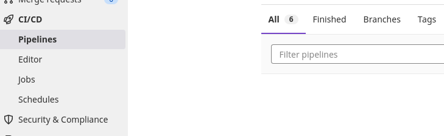

部署到k8s

测试cd

```
deploy2K8S:
  stage: deploy
  script:
    - kubectl set image deployment/log-collection log-collection=registry.crc.test:5000/test/log-collection:main-25 -n test 
```


ci-cd

```
# stage也可以自定义
stages:
  - build jar
  - build image
  - deploy image

#job's name 可以随意取
buildJar:
  stage: build jar
  script:
    - mvn clean package
    - docker build -t registry.crc.test:5000/test/log-collection:${CI_COMMIT_REF_NAME}-${CI_JOB_ID} .
    - docker push registry.crc.test:5000/test/log-collection:${CI_COMMIT_REF_NAME}-${CI_JOB_ID}
    
  artifacts:
    paths:
      - target/log-collection-demo-0.0.1-SNAPSHOT.jar
    expire_in: 3600 seconds

deploy2K8S:
  stage: deploy image
  script:
    - kubectl set image deployment/log-collection log-collection=registry.crc.test:5000/test/log-collection:${CI_COMMIT_REF_NAME}-${CI_JOB_ID} -n test 
```

以上的deploy image 会出错,因为ci_job_id不是同一个id了,使用下一个demo


或者如果上面的出错,先清理rm -rf /root/gitalb-practice/builds/WbSLxsBF/0/test/log-collection,再retry 出错的stage,

或者

就在一个stage 内执行完成

```
# stage也可以自定义
stages:
  - build jar
  - build image
  - deploy image

#job's name 可以随意取
buildJar:
  stage: build jar
  script:
    - mvn clean package
    - docker build -t registry.crc.test:5000/test/log-collection:${CI_COMMIT_REF_NAME}-${CI_JOB_ID} .
    - docker push registry.crc.test:5000/test/log-collection:${CI_COMMIT_REF_NAME}-${CI_JOB_ID}
    - kubectl set image deployment/log-collection log-collection=registry.crc.test:5000/test/log-collection:${CI_COMMIT_REF_NAME}-${CI_JOB_ID} -n test 
    
  artifacts:
    paths:
      - target/log-collection-demo-0.0.1-SNAPSHOT.jar
    expire_in: 3600 seconds

```


注意,以上的　deployment也要有imagePullSecrets,来拉取本地有口令的仓库

```
 spec:
      containers:
      - image: quay.io/qxu/log-collection:main
        imagePullPolicy: Always
        name: log-collection
        ports:
        - containerPort: 8080
          protocol: TCP
        resources: {}
        terminationMessagePath: /dev/termination-log
        terminationMessagePolicy: File
      dnsPolicy: ClusterFirst
      imagePullSecrets:
      - name: regcred


```


确保/home/gitlab-runner/.kube/config有权限访问k8s


使用CI_PIPELINE_ID代替CI_JOB_ID

https://www.5axxw.com/questions/content/liroca


```
# stage也可以自定义
stages:
  - build jar
  - build image
  - deploy image

#job's name 可以随意取
buildJar:
  stage: build jar
  script:
    - mvn clean package
    - docker build -t hub.taikang1.local/test/log-collection:${CI_COMMIT_REF_NAME}-${CI_PIPELINE_ID} .
    - docker push hub.taikang1.local/test/log-collection:${CI_COMMIT_REF_NAME}-${CI_PIPELINE_ID}
  artifacts:
    paths:
      - target/log-collection-demo-0.0.1-SNAPSHOT.jar
    expire_in: 3600 seconds

deploy2K8S:
  stage: deploy image
  script:
    - kubectl set image deployment/log-collection log-collection=hub.taikang1.local/test/log-collection:${CI_COMMIT_REF_NAME}-${CI_PIPELINE_ID} -n user1

```


在左侧菜单中可以看一下pipeline和job的区别


