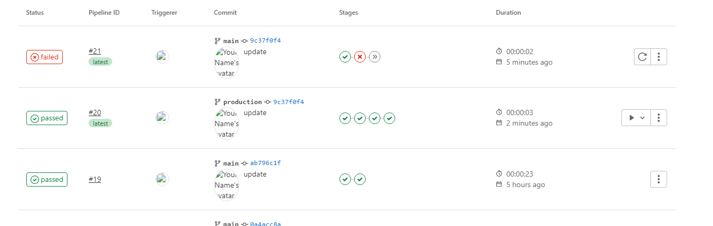

https://docs.gitlab.com/ee/ci/pipelines/

## pipeline

https://docs.gitlab.com/ee/ci/pipelines/index.html

 中文说明:

https://segmentfault.com/a/1190000011890710

### basic pipeline

​	https://docs.gitlab.com/ee/ci/pipelines/pipeline_architectures.html#basic-pipelines

```
stages:
  - build
  - test
  - deploy

image: alpine

build_a:
  stage: build
  script:
    - echo "This job builds something."

build_b:
  stage: build
  script:
    - echo "This job builds something else."

test_a:
  stage: test
  script:
    - echo "This job tests something. It will only run when all jobs in the"
    - echo "build stage are complete."

test_b:
  stage: test
  script:
    - echo "This job tests something else. It will only run when all jobs in the"
    - echo "build stage are complete too. It will start at about the same time as test_a."

deploy_a:
  stage: deploy
  script:
    - echo "This job deploys something. It will only run when all jobs in the"
    - echo "test stage complete."
  environment: production

deploy_b:
  stage: deploy
  script:
    - echo "This job deploys something else. It will only run when all jobs in the"
    - echo "test stage complete. It will start at about the same time as deploy_a."
  environment: production
```


###  区分不同分支的情况

https://docs.gitlab.com/ee/ci/yaml/#whenmanual

```
stages:
  - build
  - deploy
  - test
  - prod-deploy

build-for-testing:
  stage: build
  only:
    - develop
    - master
    - main
  script:
    - echo "build for testing"

prod-build:
  stage: build
  only:
    - production
  script:
    - echo "build for production"
    
deploy-for-testing:
  stage: deploy
  only:
    - develop
    - master
    - production
    - main
  script:
    - echo "deploy for testing"

testing:
  stage: test
  only:
    - develop
    - master
    - production
    - main
  script:
    - echo "auto testing"

prod-deploy:
  stage: prod-deploy
  only:
    - production
  script:
    - echo "deploy to production server"
  when: manual
```

分别在main和production分支上修改代码,查看pipeline的步骤

查看manual的job上有个三角





如何支持多个gitlab-ci.yml?

目前不支持,不同的分支,可使用不同的.gitlab-ci.yml内容


### 使用 image as build env

```
image: maven:3-jdk-8

stages:
  - build
  - test
  - deploy

job_build:
  stage: build
  script:
    - mvn clean install
  only:
    - develop
  tags:
    - hwy

job_test:
  stage: test
  script:
    - mvn test
  tags:
    - hwy

job_deploy:
  stage: deploy
  script:
    - echo "deploy over..."
  tags:
    - hwy
```

