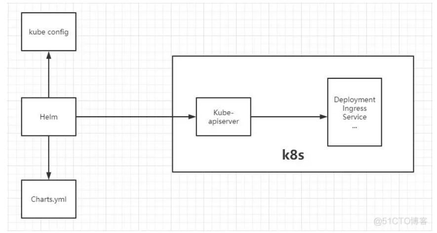

## Helm 是什么？？

`Helm` 是 Kubernetes 的包管理器。包管理器类似于我们在 Ubuntu 中使用的apt、Centos中使用的yum 或者Python中的 pip 一样，能快速查找、下载和安装软件包。Helm 由客户端组件 helm 和服务端组件 Tiller 组成, 能够将一组K8S资源打包统一管理, 是查找、共享和使用为Kubernetes构建的软件的最佳方式。


## Helm 解决了什么痛点？

在 Kubernetes中部署一个可以使用的应用，需要涉及到很多的 Kubernetes 资源的共同协作。比如你安装一个 WordPress 博客，用到了一些 Kubernetes (下面全部简称k8s)的一些资源对象，包括 Deployment 用于部署应用、Service 提供服务发现、Secret 配置 WordPress 的用户名和密码，可能还需要 pv 和 pvc 来提供持久化服务。并且 WordPress 数据是存储在mariadb里面的，所以需要 mariadb 启动就绪后才能启动 WordPress。这些 k8s 资源过于分散，不方便进行管理，直接通过 kubectl 来管理一个应用，你会发现这十分蛋疼。 所以总结以上，我们在 k8s 中部署一个应用，通常面临以下几个问题：

- 如何统一管理、配置和更新这些分散的 k8s 的应用资源文件
- 如何分发和复用一套应用模板
- 如何将应用的一系列资源当做一个软件包管理


### Helm基本架构




## Helm 相关组件及概念

几个概念Helm 组件及相关术语

- `Helm`——Helm 是一个命令行下的**客户端工具**。主要用于 Kubernetes 应用程序 Chart 的创建、打包、发布以及创建和管理本地和远程的 Chart 仓库。
- `Chart`——Chart 代表着 **Helm 包**。它包含在 Kubernetes 集群内部运行应用程序，工具或服务所需的所有资源定义。你可以把它看作是 Homebrew formula，Apt dpkg，或 Yum RPM 在Kubernetes 中的等价物。
- `Release`——Release 是运行在 Kubernetes 集群中的 **chart 的实例**。一个 chart 通常可以在同一个集群中安装多次。每一次安装都会创建一个新的 release。
- `Repoistory`——Repository（**仓库**） 是用来存放和共享 charts 的地方。可以类比成Maven仓库。


https://www.cnblogs.com/liugp/p/16659802.html

### 1）Chart 目录结构

```bash
# 通过helm create命令创建一个新的chart包
helm create nginx
tree nginx

nginx/
├── charts
├── Chart.yaml
├── templates
│   ├── deployment.yaml
│   ├── _helpers.tpl
│   ├── hpa.yaml
│   ├── ingress.yaml
│   ├── NOTES.txt
│   ├── serviceaccount.yaml
│   ├── service.yaml
│   └── tests
│       └── test-connection.yaml
└── values.yaml

```


其中关键的目录和文件作用如下：

★ templates/ 目录包含了模板文件。Helm会通过模板渲染引擎渲染所有该目录下的文件来生成Chart，之后将收集到的模板渲染结果发送给K8s。

★ values.yaml 文件对于模板也非常重要。这个文件包含了对于一个Chart的默认值 。这些值可以在用户执行Helm install 或 Helm upgrade时指定新的值来进行覆盖。

★ Chart.yaml 文件包含对于该Chart元数据描述。这些描述信息可以在模板中被引用。

★ _helper.tpl 包含了一些可以在Chart中进行复用的模板定义。

★ 其他诸如deployment.yaml、service.yaml、ingress.yaml文件，就是我们用于生成K8s配置文件的模板，Helm默认会按照如下的顺序将生成资源配置发送给K8s:

★`charts`目录： [可选]，该目录中放置当前Chart依赖的其它Chart


### Chart.yaml 文件

```bash
apiVersion: chart API 版本 （必需）
name: chart名称 （必需）
version: chart 版本，语义化2 版本（必需）
kubeVersion: 兼容Kubernetes版本的语义化版本（可选）
description: 一句话对这个项目的描述（可选）
type: chart类型 （可选）
keywords:
  - 关于项目的一组关键字（可选）
home: 项目home页面的URL （可选）
sources:
  - 项目源码的URL列表（可选）
dependencies: # chart 必要条件列表 （可选）
  - name: chart名称 (nginx)
    version: chart版本 ("1.2.3")
    repository: （可选）仓库URL ("https://example.com/charts") 或别名 ("@repo-name")
    condition: （可选） 解析为布尔值的yaml路径，用于启用/禁用chart (e.g. subchart1.enabled )
    tags: # （可选）
      - 用于一次启用/禁用 一组chart的tag
    import-values: # （可选）
      - ImportValue 保存源值到导入父键的映射。每项可以是字符串或者一对子/父列表项
    alias: （可选） chart中使用的别名。当你要多次添加相同的chart时会很有用
maintainers: # （可选）
  - name: 维护者名字 （每个维护者都需要）
    email: 维护者邮箱 （每个维护者可选）
    url: 维护者URL （每个维护者可选）
icon: 用做icon的SVG或PNG图片URL （可选）
appVersion: 包含的应用版本（可选）。不需要是语义化，建议使用引号
deprecated: 不被推荐的chart （可选，布尔值）
annotations:
  example: 按名称输入的批注列表 （可选）.
```


## Helm 安装 Chart 包的三种方式

Helm 自带一个强大的搜索命令，可以用来从两种来源中进行搜索：

- `helm search hub` 从 [Artifact Hub](https://artifacthub.io/) 中查找并列出 helm charts。 Artifact Hub中存放了大量不同的仓库。
- `helm search repo` 从你添加（使用 `helm repo add`）到本地 helm 客户端中的仓库中进行查找。该命令基于本地数据进行搜索，无需连接互联网。

```bash
# 添加bitnami仓库源
helm repo add bitnami https://charts.bitnami.com/bitnami
# 从bitnami源查找所有chart包，不指定具体源的话，会查找本地添加的所有源地址的所有chart包
helm search repo bitnami
```

### 1）values 传参

安装过程中有两种方式传递配置数据：

- `--values (或 -f)`：使用 YAML 文件覆盖配置。可以指定多次，优先使用最右边的文件。
- `--set`：通过命令行的方式对指定项进行覆盖。

如果同时使用两种方式，则 --set 中的值会被合并到 --values 中，但是 `--set`中的值**优先级更高**。在--set 中覆盖的内容会被被保存在 ConfigMap 中。可以通过 `helm get values <release-name>` 来**查看指定 release 中 --set 设置的值**。也可以通过运行 helm upgrade 并指定 --reset-values 字段来清除 --set 中设置的值。示例如下：

```bash
echo '{mariadb.auth.database: user0db, mariadb.auth.username: user0}' > values.yaml
helm install -f values.yaml bitnami/wordpress --generate-name
```

### 2）【第一种方式】直接在线 安装不需要先下载包到本地

```bash
helm install mysql bitnami/mysql
helm list
```

### 3）【第二种方式】离线安装 直接通过安装包安装

```bash
# 先删除
helm uninstall mysql
# 拉包到本地
helm pull bitnami/mysql
# 不解压直接安装
helm install mysql ./mysql-9.3.1.tgz
helm list
```

### 4）【第三种方式】离线安装 解压包再安装

```bash
# 拉包到本地
helm pull bitnami/mysql
# 解压安装
tar -xf mysql-9.3.1.tgz

# 开始安装
helm install mysql ./mysql \
--namespace=mysql \
--create-namespace \
--set image.registry=myharbor.com \
--set image.repository=bigdata/mysql \
--set image.tag=8.0.30 \
--set primary.service.type=NodePort \
--set service.nodePorts.mysql=30306

# 查看在运行的Release
helm list

# 卸载
helm uninstall mysql -n mysql 
```

## 

### 1）变量

模板（`templates/`）中的**变量**都放在`{{}}`

Helm命令解析
命令	描述
create	创建应用模板
install	安装charts
list	列出本地release
pull	下载charts到本地目录
package	将chart目录打包为chart归档包
show	查看cahrts内容
uninstall	卸载release
upgrade	更新releasr
version	查看helm版本号
