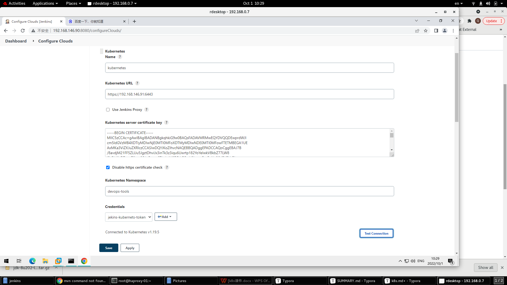
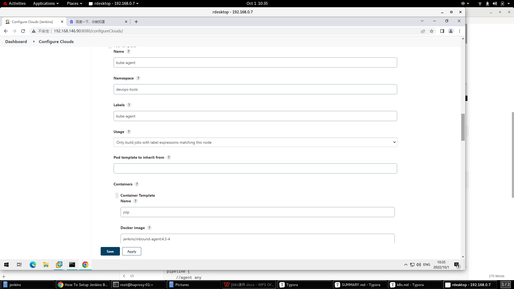
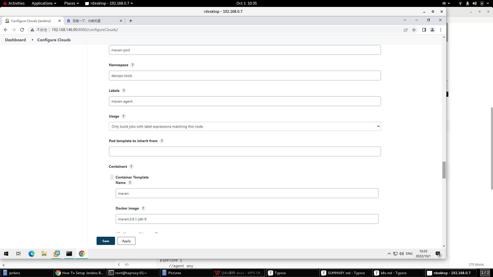
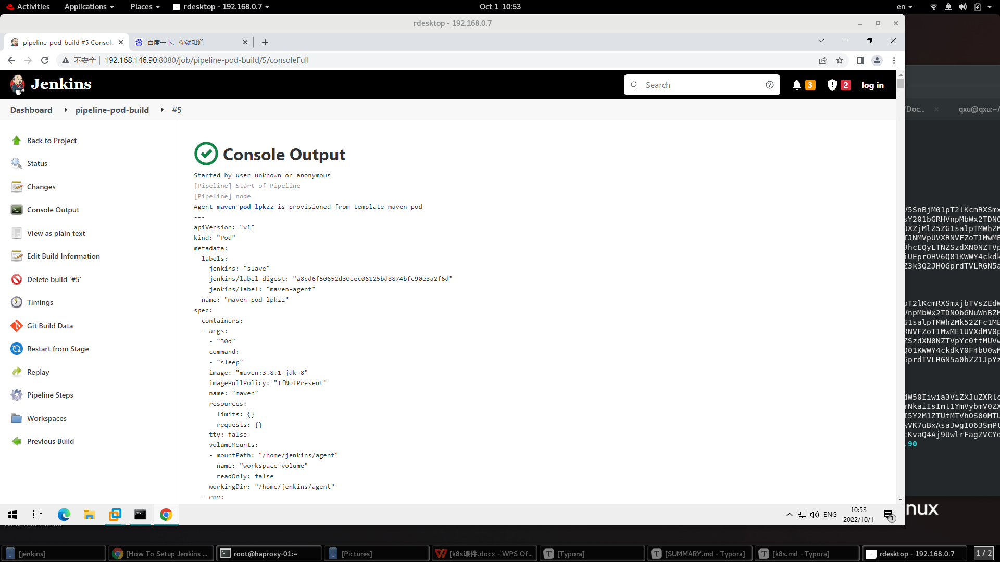
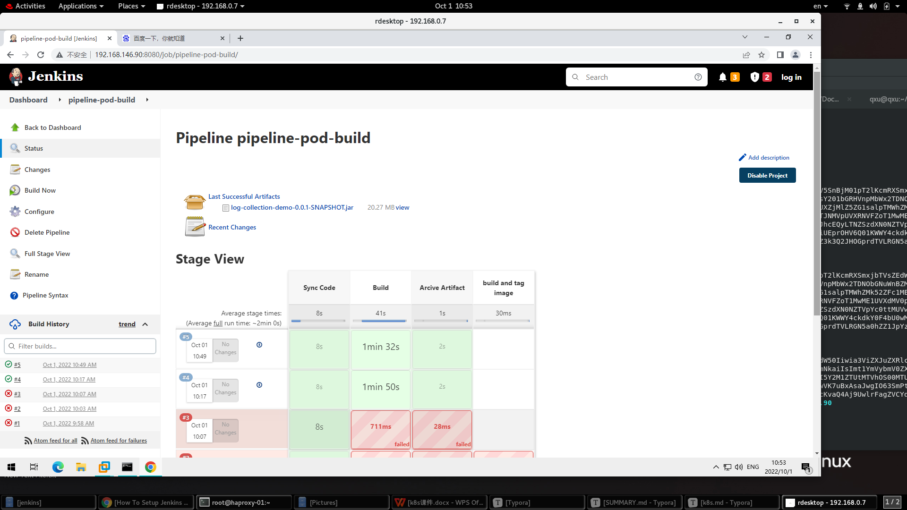

## 外置jenkins访问k8s

#### 方式1.使用KUBECONFIG,

在jenkins起动帐号下,将有集群admin访问权限的文件文放在:　/root/.docker/config,

在pipeline中定义此变量,后面就可以在job中使用kubctl命令了.

```
pipeline {
    agent any
    environment {
        KUBECONFIG="/root/.kube/config" 
    }
```

类似的方式可以用来访问docker registry,在/root/.docker/config.json 中保存registry的访问口令用户,

可以在job中使用docker push命令,不行输入口令和用户名


#### 方式２.使用kubernetes plugin

构建时使用k8s pod做为jenkins slave node

https://devopscube.com/jenkins-build-agents-kubernetes/


##### 添加k8s集群的配置



###### kuberneters server certificate key,

从/root/.kube/config,

```
cat .kube/config |grep certificate-authority-data|awk '{print $2}'|base64 -d


```


namepsace使用已经部署过内部jenkins的namespace,里面有建立好的service account

credentials使用devops-tools中的jenkins-admin-xxx secret,参考link中的建立方式,secret text方式

```
kubectl get secret jenkins-admin-token-6rcdj -o yaml -n devops-tools|grep " token: "|awk '{print $2}'|base64 -d

#for tk traing, use kube-system ns's admin token:
kubectl get secret hyperkuber -n kube-system -o yaml |grep " token: "|awk '{print $2}'|base64 -d
```


##### 添加两个pod template,jnlp and maven配置如下:

jenkins/inbound-agent:4.3-4







##### 建立一个测试job,如link所示例的,free style , restrict to node, maven-agent, ehco host name,

第一次使用ntlp时,要关闭jenkins jnlp的disable配置.

(在全局安全中,>代理　->**TCP port for inbound agents**,使用随机端口)


```
#check in k8s ,there is pod runing
[root@jenkins ~]# kubectl get pod -n user1
NAME                             READY   STATUS              RESTARTS   AGE
kube-agent-412mr                 0/1     ContainerCreating   0          9s

```


##### 建立一个maven build job,注意container('maven')的应用,当有多个container里,一定要有这个配置,

也可以删除上面的kube-agent pod template


```
pipeline {
    //agent any
    agent {
        label "maven-agent"
    }
    environment {
        REPO_URL = "https://gitee.com/xuqw123/log-collection"
        TAG="registry.crc.test:5000/abc/log-collection:$BUILD_NUMBER"
    }

    stages {
        stage ('Sync Code') {
            steps {
                 git branch: 'master', url: "$REPO_URL"
            }    
        }
        stage ('Build') {
            steps {
                container('maven') {
                  echo "Build..."
                  sh '/usr/bin/mvn -s configuration/aliyun-settings.xml package ' 
                }
            }    
        }

        stage('Arcive Artifact') {
            steps {
              echo "save artifact"
              archiveArtifacts '**/target/*.jar'
            }
        }


    }    
}
```







其他方式,合适kubect-cli插件等


#### 在k8s的pod中构建image

https://devopscube.com/build-docker-image-kubernetes-pod/


```
kubectl create secret docker-registry dockercred \
    --docker-server=https://hub.taikang1.local \
    --docker-username=admin \
    --docker-password=redhat \
    -n user1
```


```
podTemplate(yaml: '''
    apiVersion: v1
    kind: Pod
    spec:
      containers:
      - name: maven
        image: maven:3.8.1-jdk-8
        command:
        - sleep
        args:
        - 99d
      - name: kaniko
        image: quay.io/qxu/executor:debug
        command:
        - sleep
        args:
        - 9999999
        volumeMounts:
        - name: kaniko-secret
          mountPath: /kaniko/.docker
      restartPolicy: Never
      volumes:
      - name: kaniko-secret
        secret:
            secretName: dockercred
            items:
            - key: .dockerconfigjson
              path: config.json
''') {
  node(POD_LABEL) {
    stage('Get a Maven project') {
      git url: 'https://gitee.com/xuqw123/log-collection', branch: 'master'
      container('maven') {
        stage('Build a Maven project') {
          sh '''
          mvn -s configuration/aliyun-settings.xml clean package
          '''
        }
      }
    }

    stage('Build Java Image') {
      container('kaniko') {
        stage('Build a Java Image') {
          sh '''
            /kaniko/executor --insecure --context `pwd`  --no-push --destination hub.taikang1.local/abc/log-collection:v1.0
          '''
        }
      }
    }

  }
}
```


image 中如何挂载.kube/config

https://zhuanlan.zhihu.com/p/40346581


