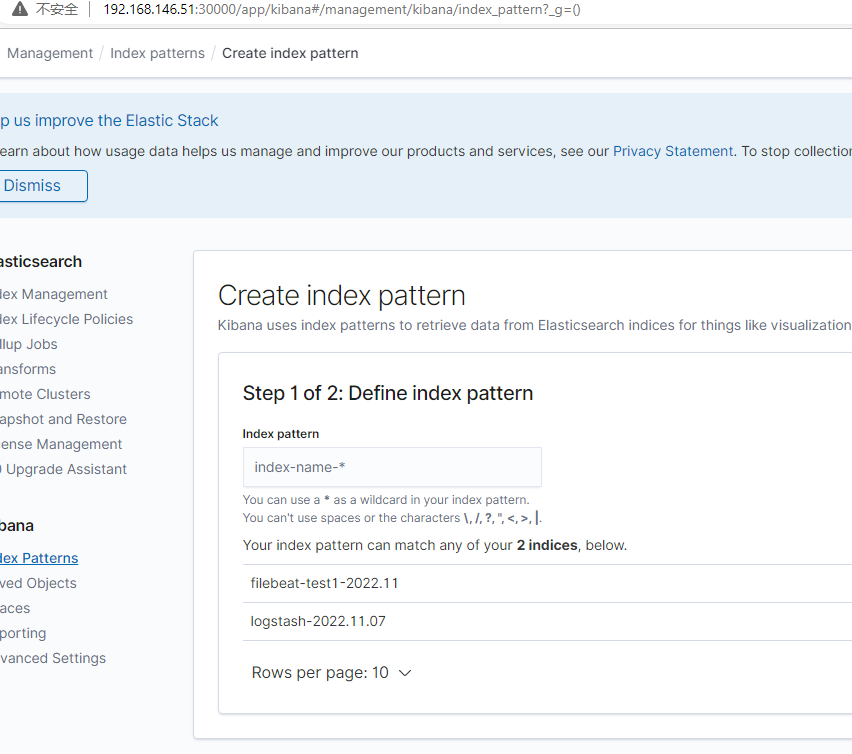
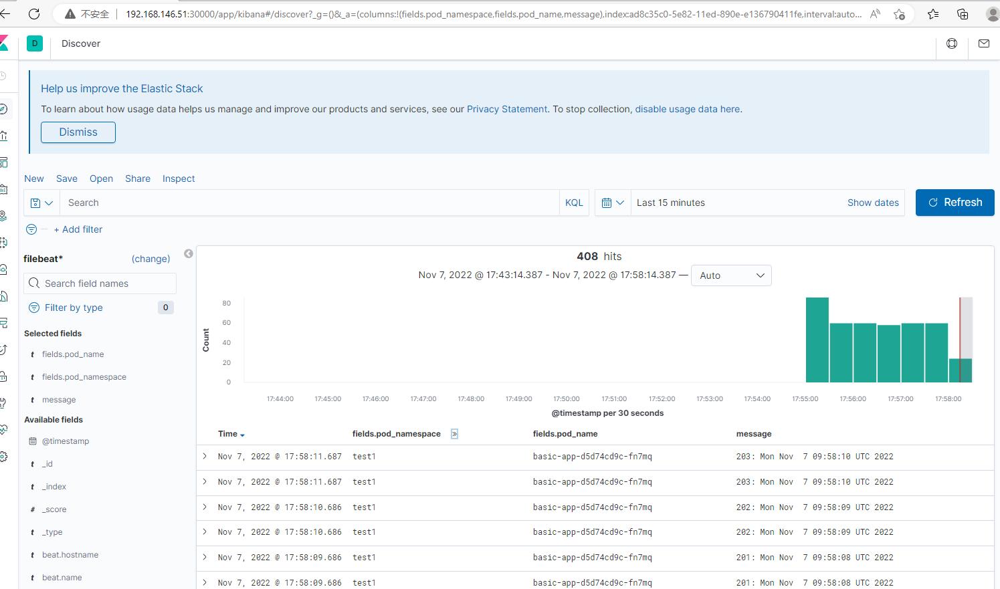

收集pod内的文件到内部es

image 版本兼容性检查 ， filebeat with es: https://www.elastic.co/support/matrix#matrix_compatibility

```
docker.elastic.co/beats/filebeat-oss:6.8.16
```

es ca from fluentd:

```

```

filebeat configmap,注意下面的es https还是http,如果 是https需要三个其他的证书等 配置

```
[root@qxu filebeat-sidecar-es-new]# cat cm-es.yaml 
apiVersion: v1
kind: ConfigMap
metadata:
  name: filebeat-config
data:
  filebeat.yml: |-
    filebeat.inputs:
    - type: log
      paths:
      - /var/applog/basic-app.log
      - /var/applog/advance-app.log
      fields:
        pod_name: '${POD_NAME}'
        pod_namespace: '${POD_NAMESPACE}'
        pod_ip: '${POD_IP}'
        node_name: '${NODE_NAME}'
    output.elasticsearch:
      #hosts: ["http://elasticsearch.logging.svc.cluster.local:9200"]
      hosts: ["http://elasticsearch-master.elastic-system.svc.cluster.local:9200"]
      index: "mybeat-${POD_NAMESPACE}-%{+yyy.MM}"
    setup.template:
      enabled: false
      
kubectl apply -f es-cm.yaml -n test1
```

注意下面的地址,要与实际配置的一样,http://elasticsearch.logging.svc.cluster.local:9200

有可能是部在default ns,要必为:　http://elasticsearch.default.svc.cluster.local:9200

permssion:

```
＃filebeat启动需要以下两个权限


```

deployment:


```
kind: "Deployment"
apiVersion: apps/v1
metadata:
  name: basic-app
spec:
  replicas: 1
  selector:
    matchLabels:
      app: basic-app
  template:
    metadata:
      labels:
        app: basic-app
    spec:
      containers:
        - name: mainappcontainer
          image: "python:3.6"
          args:
            - /bin/sh
            - -c
            - >
              i=0;
              while true;
              do
                echo "$i: $(date)"
                i=$((i+1));
                sleep 1;
              done |tee /var/applog/basic-app.log /var/applog/advance-app.log >/dev/null
          volumeMounts:
          - name: varlog
            mountPath: /var/applog/

      volumes:
      - name: varlog
        emptyDir: {}

```


```
[root@qxu filebeat-sidecar-es-new]# cat dc-sidecar.yaml 
kind: "Deployment"
apiVersion: apps/v1
metadata:
  name: basic-app
spec:
  replicas: 1
  selector:
    matchLabels:
      app: basic-app
  template:
    metadata:
      labels:
        app: basic-app
    spec:
      containers:
        - name: mainappcontainer
          image: "python:3.6"
          args:
            - /bin/sh
            - -c
            - >
              i=0;
              while true;
              do
                echo "$i: $(date)"
                i=$((i+1));
                sleep 1;
              done |tee /var/applog/basic-app.log /var/applog/advance-app.log >/dev/null
          volumeMounts:
          - name: varlog
            mountPath: /var/applog/

        - name: shinysidecar
          image: docker.elastic.co/beats/filebeat-oss:6.8.16
          args: [
             "-c", "/etc/filebeat/filebeat.yml",
             "-e",
            ]
          env:
          - name: POD_NAMESPACE
            valueFrom:
              fieldRef:
                fieldPath: metadata.namespace
          - name: POD_NAME
            valueFrom:
              fieldRef:
                fieldPath: metadata.name
          - name: POD_IP
            valueFrom:
              fieldRef:
                fieldPath: status.podIP
          - name: NODE_NAME
            valueFrom:
              fieldRef:
                fieldPath: spec.nodeName
          volumeMounts:
          - name: varlog
            mountPath: /var/applog/
          - name: config-volume
            mountPath: /etc/filebeat/
          #securityContext:
          #  runAsUser: 0
          #  privileged: true
      volumes:
      - name: varlog
        emptyDir: {}
      - name: config-volume
        configMap:
          name: filebeat-config

kubectl apply -f dc.yaml -n test1

```


go to kibana,create index pattern:







index manage:

in efk(filebeat, the index will be created automatically)

https://kibana.elastic-system.apps.taikang1.local/app/management/data/index_management/indices


index pattern:

https://kibana.elastic-system.apps.taikang1.local/app/management/kibana/indexPatterns


其他方案:

# log-pilot使用

https://cloud.tencent.com/developer/article/1540598

https://www.jianshu.com/p/120c77d155c4

