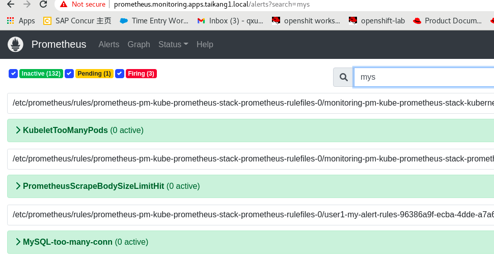
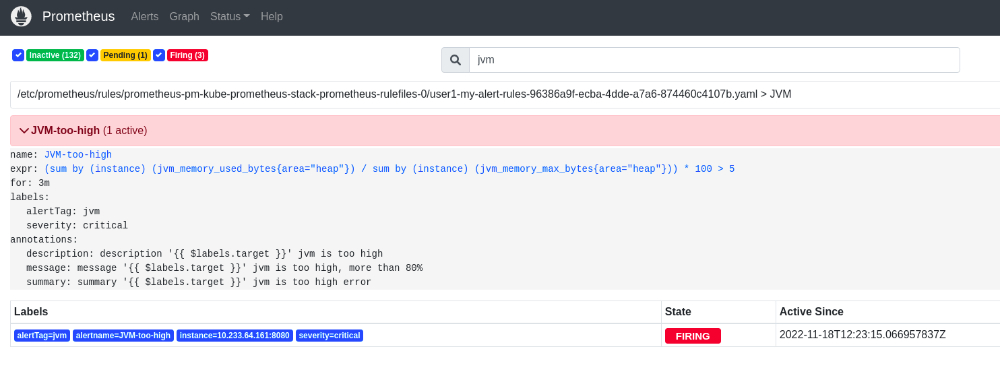

### 添加自定义alerts

参考这里,有很多自定义的

https://awesome-prometheus-alerts.grep.to/rules.html#jvm


https://github.com/infinityworks/prometheus-example-queries


查看现有的rules:

```
# kubectl get PrometheusRule  -n monitoring
NAME                   AGE
prometheus-k8s-rules   24d

#for tk env
kubectl get prometheusrules -o yaml -n monitoring 


```


添加一个jvm的使用测试,以下操在monitoring建立，如果 在用户的nm中建立 ，在alertmanager UI中发现不了。(在用户nm建立alert rule 可以的,要给alertmanager service account相应的权限就可以发现这些rules)

```
apiVersion: monitoring.coreos.com/v1
kind: PrometheusRule
metadata:
  labels:
    prometheus: k8s
    role: alert-rules
    release: pm
  name: my-alert-rules
spec:
  groups:
    - name: JVM
      rules:
        - alert: JVM-too-high 
          annotations:
            summary: summary '{{ $labels.target }}' jvm is too high error
            description: description '{{ $labels.target }}' jvm is too high
            message: message '{{ $labels.target }}' jvm is too high, more than 80%
          expr: |
            (sum by (instance)(jvm_memory_used_bytes{area="heap"}) / sum by (instance)(jvm_memory_max_bytes{area="heap"})) * 100 > 5
          for: 3m
          labels:
            severity: critical
            alertTag: jvm
    - name: MySQL
      rules:
        - alert: MySQL-too-many-conn
          annotations:
            summary: summary '{{ $labels.target }}' mysql is too many conn
            description: description '{{ $labels.target }}' mysql is too many conn
            message: message '{{ $labels.target }}'  too many conn, more than 80
          expr: |
            avg by (instance) (rate(mysql_global_status_threads_connected[1m])) / avg by (instance) (mysql_global_variables_max_connections) * 100 >=0
          for: 3m
          labels:
            severity: critical
            alertTag: mysql


```

### 查看

可以在prometheus web UI, alerts中发现已经firing的上面的两个alert








#### 配置报警发送到其他系统:

https://blog.csdn.net/qq_33430322/article/details/89349827

```
kubectl get secret  -o yaml -n monitoring

kubectl get secret alertmanager-pm-kube-prometheus-stack-alertmanager -o yaml -n monitoring


kubectl get secret alertmanager-pm-kube-prometheus-stack-alertmanager -o jsonpath={".data.alertmanager\.yaml"}  -n monitoring |base64 -d
global:
  resolve_timeout: 5m
inhibit_rules:
- equal:
  - namespace
  - alertname
  source_matchers:
  - severity = critical
  target_matchers:
  - severity =~ warning|info
- equal:
  - namespace
  - alertname
  source_matchers:
  - severity = warning
  target_matchers:
  - severity = info
- equal:
  - namespace
  source_matchers:
  - alertname = InfoInhibitor
  target_matchers:
  - severity = info
receivers:
- name: "null"
route:
  group_by:
  - namespace
  group_interval: 5m
  group_wait: 30s
  receiver: "null"
  repeat_interval: 12h
  routes:
  - matchers:
    - alertname =~ "InfoInhibitor|Watchdog"
    receiver: "null"
templates:
- /etc/alertmanager/config/*.tmpl


```

